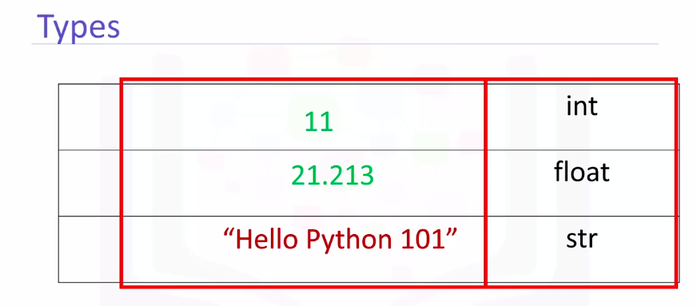
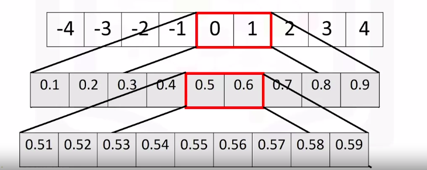
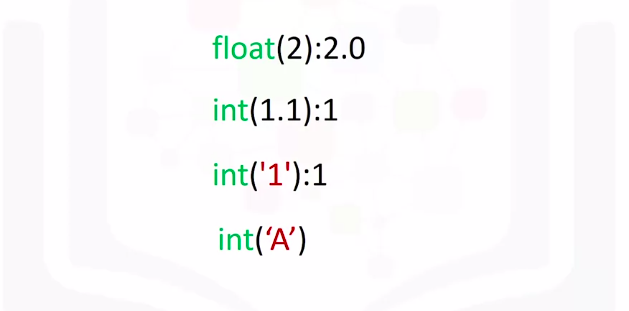
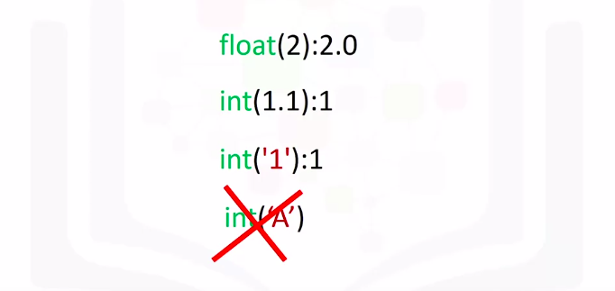
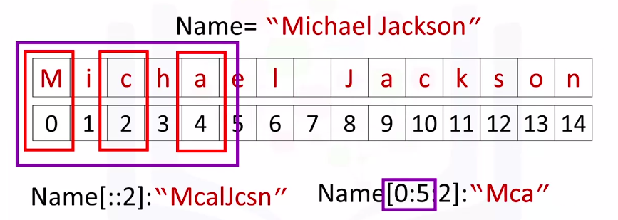
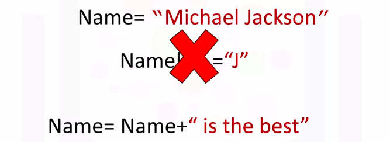
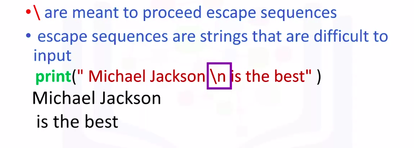

Python for Data Science and AI
===============================

by IBM

# Module 1

## Key Concepts
* Demonstrate an understanding of types in python by converting/casting data types: strings, floats, integers.
* Interpret variables and solve expressions by applying mathematical operations.
* Describe how to manipulate strings by using a variety of methods and operations.

#
## Title: Python Basics

## Types

### Types

> In Python, if you cast a float to an integer, the conversion truncates towards zero, i.e.you just get rid of the numbers after the decimal place. So for 3.99 you just get rid of the ".99" leaving 3.

* A type is how Python represents different types of data
* There are different types in python
	1. integers like 11
	1. real numbers like 21.213
	1. they can even be words
* Integers, real numbers, and words can be expressed as different **data types**
* In image below
	1. First column indicates the expression
	1. Second column indicates the data type
		<p align="center">
		  <a href="javascript:void(0)" rel="noopener">
			 </a>
		</p>
* We can see the actual data type in Python by using the **type** command
	*  **int**, which stands for an integer
		* Integers can be negative or positive
		* there is a finite range of integers but it is quite large
	* **float** that stands for float, essentially a real number
		* Floats are real numbers. They include the integers but also numbers in between the integers
		* Consider the numbers between 0 and 1
		* Similarly, consider the numbers between 0.5 and 0.6. We can select numbers in between them. These are floats as well
			<p align="center">
			  <a href="javascript:void(0)" rel="noopener">
				 </a>
			</p>
	* **string** is a sequence of characters
* **Typecasting** - To change the type of the expression in Python
	* Conversion of an int to a float
	* For example, 
		1. you can convert or cast the integer 2 to a float 2.0
	* If you cast a **float** to an **integer**, you must be careful
		* For example, if you cast the float 1.1 to 1, you will lose some information 
	* If a string contains an integer value, you can convert it to **int**
	* If we convert a string that contains a non-integer value, we get an **error**
		<p align="center">
		  <a href="javascript:void(0)" rel="noopener">
			 </a>
		</p>
		* Last statement in this image will throw an error.
			```python
			>>> int('A') ## This will throw an error
			```
			<p align="center">
			  <a href="javascript:void(0)" rel="noopener">
				 </a>
			</p>
	* int and float can be converted to string
		```python
		>>> str(1) ## Converting int to String
			'1'
		>>> str(2.34) ## Converting float to String
			'2.34'
		```
* Boolean
	* Boolean is another important type in Python
	* A Boolean can take on two values
		* The first value is True, we use an uppercase T
		* Boolean values can also be False with an uppercase F
	* Using the type command on a Boolean value, we obtain the term bool
		```python
		>>> type(True)
			bool #this is short for boolean
		```
	* If we cast a Boolean True to an integer or float, we will get a 1
	* If we cast a Boolean False to an integer or float, we get a 0
	* If you cast a 1 to a Boolean, you get a True
	* If you cast a 0 to a Boolean, you get a False

## Expressions and Variables

### Expressions and Variables

* **Expressions** describe a type of operation the computers perform
	* Expressions are operations the python performs
		* For example, basic arithmetic operations like adding multiple numbers
	* We call the numbers **operands**, and the math symbols in this case, addition, are called **operators**
		<p align="center">
		  <a href="javascript:void(0)" rel="noopener">
			 </a>
		</p>
		<p align="center">
		  <a href="javascript:void(0)" rel="noopener">
			 </a>
		</p>
* Operations like
	1. Subtraction - Can be done using 'subtraction sign' `-`
	1. Multiplication - Can be done using 'asterisk sign' `*`
	1. Addition - Can be done using 'plus sign' `+`
	1. Division - Can be done using 'forward slash sign' `/`
	1. Integer Division - Can be done using 'double forward slash sign' `//`
		* Be aware, in some cases the results are not the same as regular division
* The following operations are in a different order
	* In both cases, Python performs multiplication, then addition, to obtain the final result
 	* The expressions in the parentheses are performed first
 * **Variables**
 	* These are used to store values
 	* We can use exact name of variable to get the value somewhere else in the code
 	* We can use a **colon** to denote the value of the variable
 	* We can assign a new value to the variable using the **assignment operator** `=`
 	* We can store the results of expressions
 		* For example, we add several values and assign the result to x. X now stores the result
 			* We can also perform operations on x and save the result to a new variable `y`
 				<p align="center">
				  <a href="javascript:void(0)" rel="noopener">
					 </a>
				</p>
			* The expression `x=x/2` changes the value of **x**, if **x** is assigned to its self
				* It's helpful to replace the value of **x** with its current value, in this case 4 or x=4/2
					* We can also see that the result is a float
						```python
						>>> x = 4
						>>> x = x/2
						>>> print(x)
							2.0
						```
	* It is a good practice to use meaningful variable names
		<p align="center">
		  <a href="javascript:void(0)" rel="noopener">
			 </a>
		</p>

## String Operations

### String Operations

* A **string** is a sequence of characters
* A **string** is contained within two quotes or single quotes
* A string can be 
	1. Spaces or Digits
	1. Special Characters
* We can bind or assign a string to another variable
* It is helpful to think of a string as an **ordered sequence**
* Each element in the sequence can be accessed using an index represented by the array of numbers
	* We can also use negative indexing with strings. The last element is given by the index **-1**
* We can think of string as a list or tuple
* We can treat the string as a sequence and perform sequence operations
	* For Example
		* We can input a stride value as follows
			* The two indicates we'd select every second variable
				<p align="center">
				  <a href="javascript:void(0)" rel="noopener">
					 </a>
				</p>
* We can also incorporate slicing
	* For Example:
		* In image mentioned below, we return every second value up to index four
			<p align="center">
			  <a href="javascript:void(0)" rel="noopener">
				 </a>
			</p>
* We can use the **len** command to obtain the length of the string
* We can concatenate or combine strings
	* We use the addition symbols
		```python
		>>> name = 'piyush'
		>>> full_name = name + ' sambhi'
		>>> full_name
			'piyush sambhi'
		```
* We can replicate values of a string. We simply multiply the string by the number of times we would like to replicate it
	* The new string consists of three copies of the original string
		```python
		>>> 'test ' * 3
			test test test 
		```
* String is **Immutable**
	* This means you cannot change the value of the string, but you can create a new string
		<p align="center">
		  <a href="javascript:void(0)" rel="noopener">
			 </a>
		</p>
	* The result is a new string that changes from Michael Jackson to Michael Jackson is the best
* **Escape Sequences** represent strings that may be difficult to input
	* **Back slashes** `\` represent the beginning of escape sequences
		* For example, **backslashe n** `\n` represent a new line
			* The output is given by a new line after the **backslashe n** `\n` is encountered
				<p align="center">
				  <a href="javascript:void(0)" rel="noopener">
					 </a>
				</p>
* **backslash t** `\t` represents a **tab**
	* The output is given by a tab where the **backslash t** `\t` is
* If you want to place a backslash in your string, use a double backslash
	* The result is a backslash after the escape sequence
		```python
		>>> print('I am \\ the best')
			'I am \\ the best'
		```
* We can also place an `r` in front of the string
* String methods
	1. **upper** - This method converts lowercase characters to uppercase characters
		```python
		>>> lower_string = 'this is test string'
		>>> upper_string = lower_string.upper()
		>>> upper_string
			'THIS IS TEST STRING'
		```
	1. **replace** - The method replaces a segment of the string- i.e. a substring with a new string
		```python
		>>> sentence = 'this is a test string'
		>>> new_sentence = sentence.replace('test', 'best')
		>>> new_sentence
			'this is a best string'
		```
	1. **find** - This method finds substring in a string
		* The argument is the substring you would like to find
		* The output is the first index of the sequence
		* If the substring is not in the string, the output is **negative one**
			```python
			>>> sentence = 'Michael Jackson'
			>>> sentence.find('el')
				5
			>>> sentence.find('Jack')
				8
			>>> sentence.find('zenith')
				-1
			```
