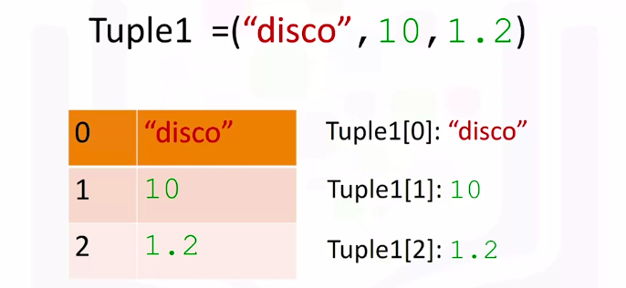
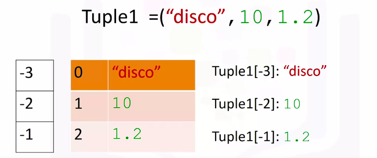
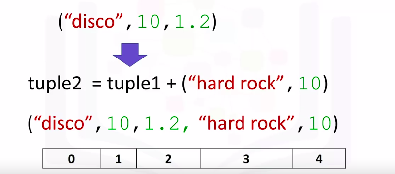
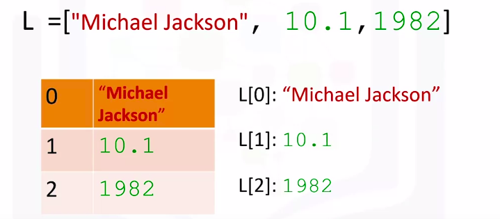
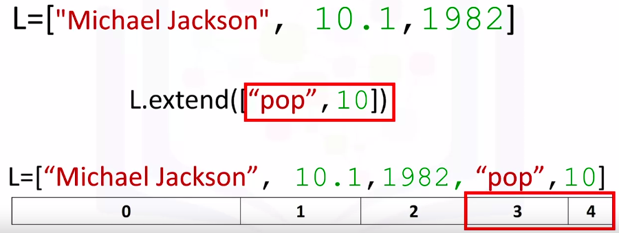
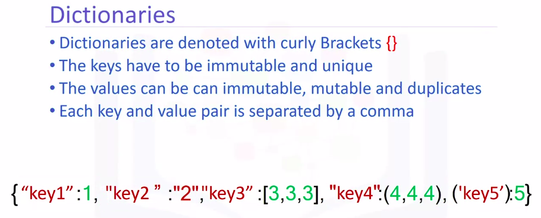
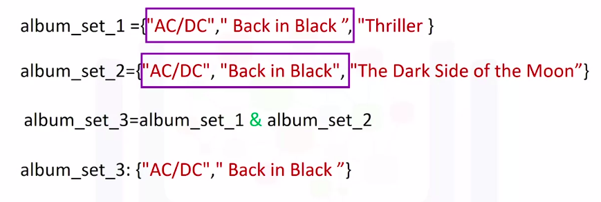
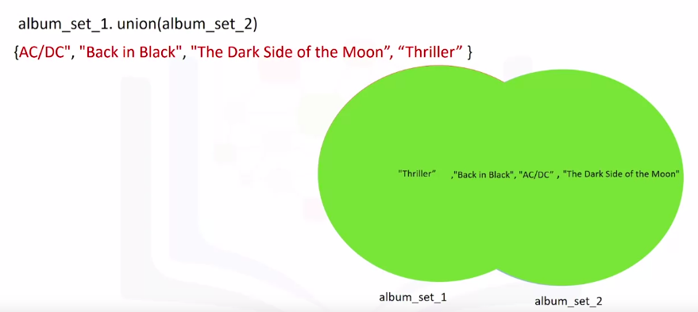

Python for Data Science and AI
===============================

by IBM

# Module 2

## Key Concepts
* Understand tuples and lists by describing and manipulating tuple combinations and list data structures.
* Demonstrate understanding of dictionaries by writing structures with correct keys and values.
* Understand the differences between sets, tuples, and lists by creating sets.

#
## Title: Python Data Structures

## Lists and Tuples

### Lists and Tuples

#### Tuples

* These are called compound data types and are one of the key types of data structures in Python
* **Tuples**, tuples are an **ordered sequence**
* **Tuples** are **expressed** as comma separated elements within parentheses `( )`
	* These are values inside the parentheses
* In Python, there are different types,strings, integer, float. They can all be contained in a tuple. But the type of the variable is tuple
* Each element of a tuple can be accessed via an index.
* The following table represents the relationship between the index and the elements in the tuple
	* Example
		* The first element can be accessed by the name of the tuple, followed by a square bracket with the index number-in this case, 0
		* We can access the second element as follows: We can also access the last element. In Python, we can use negative index
			<p align="center">
			  <a href="javascript:void(0)" rel="noopener">
				 </a>
			</p>
		* In tuples we can also use negative index to access values
			<p align="center">
			  <a href="javascript:void(0)" rel="noopener">
				 </a>
			</p>
* We can concatenate or combine tuples by adding them
	* Example
		<p align="center">
		  <a href="javascript:void(0)" rel="noopener">
			 </a>
		</p>
* We could also slice tuples
	* For example, if we want the first three elements we use the following command: The last index is one larger than the index you want
		```python
		>>> tuple1 = ('disco', 10, 1.2, 'hard rock', 10)
		>>> tuple1[0:3]
			('disco', 10, 1.2)
		>>> tuple1[3:5] # if we want the last two elements
			('hard rock', 10)
		```
* We can use the **len** command to obtain the length of the tuple
	```python
	>>> tuple1 = ('disco', 10, 1.2, 'hard rock', 10)
	>>> len(tuple1)
		5
	```
* Tuples are **immutable**
* As a consequence of immutability,if we would like to manipulate a tuple, we must create a new tuple instead
	* For example, if we would like to sort a tuple, we use the function sorted. The input is the original tuple. The output is a new sorted tuple
		```python
		>>> tuple1 = (2,6,4,8,7,9,1,3,5)
		>>> tuple1_sorted = sorted(tuple1)
		```
* A tuple can contain other tuples as well as other complex data types. This is called **nesting**
	* We can access these elements using the standard indexing methods
	* For example, we could access the second element. We can apply this indexing directly to the tuple variable NT
		<p align="center">
		  <a href="javascript:void(0)" rel="noopener">
			 </a>
		</p>
* `index` method can be used to find elements in tuple
	```python
	>>> genres_tuple = ("pop", "rock", "soul", "hard rock", "soft rock", "R&B", "progressive rock", "disco") 
	>>> genres_tuple.index('disco')
		7
	```

#### Lists

* **Lists** are also a popular data structure in Python
* Lists are also an **ordered sequence**
* A list is represented with square brackets
	* For Example
		```python
		>>> lst = ['this', 'is', 'sample', 'list']
		>>> print(lst)
			['this', 'is', 'sample', 'list']
		```
* In many respects, lists are like tuples. One key difference is they are **mutable**
* **Lists** can contain **strings**, **floats**, **integers**
* We can **nest** other lists. We also nest tuples and other data structures
* The same indexing conventions apply for **nesting**
* Like tuples, each element of a list can be accessed via an **index**
* The following table represents the relationship between the index and the elements in the list
	* The first element can be accessed by the name of the list followed by a square bracket with the index number
		* in image below it is, 0
	* We can access the second element as follows
	* We can also access the last element
	* In Python, we can use a **negative index**
		<p align="center">
		  <a href="javascript:void(0)" rel="noopener">
			 </a>
		</p>
		<p align="center">
		  <a href="javascript:void(0)" rel="noopener">
			 </a>
		</p>
* We can also perform **slicing** in lists
	* Notice how the last index is one larger than the length of the list
	* For example, if we want the last two elements in this list, we use the following command
		```python
		>>> lst = ['Michael Jackson', 10.1, 1982, 'MJ', 1]
		>>> lst[3:5]
			['MJ', 1]
		```
* The index conventions for list and tuples are identical
* We can **concatenate** or **combine** list by adding them
	<p align="center">
	  <a href="javascript:void(0)" rel="noopener">
		 </a>
	</p>
* Method:
	1. **Extend**
		<p align="center">
		  <a href="javascript:void(0)" rel="noopener">
			 </a>
		</p>
	1. **Append**
		* If we apply **append** instead of extended, we add one element to the list
	1. **Delete**
		* If we want to delete any element of the list
			<p align="center">
			  <a href="javascript:void(0)" rel="noopener">
				 </a>
			</p>
* **Split**
	* We can convert a string to a list using split
	* Example
		```python
		>>> sample_var = 'life is hard'
		>>> sample_var.split()
			['life', 'is', 'hard']
		```
	* We can also use the split function to separate strings on a specific character known as a **delimiter**
		```python
		>>> 'test string'.split(',')
			['test', 'is', 'hard']
		```
* Multiple names referring to the same object is known as **aliasing**
	* For example
		* We know from the list slide that the first element in B is set as hard rock. If we change the first element in A to banana, we get a side effect. The value of B would change as a consequence.
			<p align="center">
			  <a href="javascript:void(0)" rel="noopener">
				 </a>
			</p>
			<p align="center">
			  <a href="javascript:void(0)" rel="noopener">
				 </a>
			</p>
* Variable **A** references one list. Variable **B** references a new copy or clone of the original list. Now, if you change **A**, **B** will not change

## Dictionaries

### Dictionaries

* **Dictionaries** are a type of collection in Python
* A dictionary has keys and values
	* The key is analogous to the index. They are like addresses, but they don't have to be integers. They are usually characters
	* The values are similar to the element in a list and contain information
		<p align="center">
		  <a href="javascript:void(0)" rel="noopener">
			 </a>
		</p>
* To **create a dictionary**, we use curly brackets
	* The **keys** are the first elements. They must be immutable and unique
	* Each **key** is followed by a **value** separated by a **colon**
	* The **values** can be immutable, mutable, and duplicates
	* Each **key** and **value** pair is separated by a comma
		<p align="center">
		  <a href="javascript:void(0)" rel="noopener">
			 </a>
		</p>
* The **key** is used to look at the value
	* We use square brackets. The argument is the key
	* This outputs the **value**
		```python
		>>> sample_dict = {'a': 1, 'b': 2, 'c': 3}
		>>> sample_dict['a']
			1
		```
* To **add** a value to a dictionary
	```python
	>>> sample_dict = {'a': 1, 'b': 2, 'c': 3}
	>>> sample_dict['d'] = 4
	>>> sample_dict
		{'a': 1, 'b': 2, 'c': 3, 'd': 4}
	```
* To **delete** a value from a dictionary
	```python
	>>> sample_dict = {'a': 1, 'b': 2, 'c': 3, 'd': 4}
	>>> del(sample_dict['d'])
	>> sample_dict
		{'a': 1, 'b': 2, 'c': 3}
	```
* We can use `in` command to check if a key is present in dictionary or not
	```python
	>>> sample_dict = {'a': 1, 'b': 2, 'c': 3, 'd': 4}
	>>> 'a' in sample_dict
		True
	>>> 'z' in sample_dict
		False
	```
* In order to see all the keys in the dictionary, we can use the method `keys` to get the keys
	* The output is a list-like object with all the keys
* Similarly, We can obtain the values using the method `values`
	```python
	>>> sample_dict = {'a': 1, 'b': 2, 'c': 3, 'd': 4}
	>>> sample_dict.keys()
		['a', 'b', 'c', 'd']
	>>> sample_dict.values()
		[1, 2, 3, 4]
	```

## Sets

### Sets

* **Sets** are also a type of collection
	* This means that like lists and tuples, you can input different Python types
* Unlike lists and tuples, they are **unordered**
	* This means sets do not record element position
* **Sets** only have **unique** elements
	* This means there is only one of a particular element in a set
* To define a set, you use curly brackets
	* You place the elements of a set within the curly brackets
	* You notice there are duplicate items
	* When the actual set is created, duplicate items will not be present
		```python
		>>> set1 = {'test', 'set', 'create', 'set'}
		>>> set1
			{'create', 'set', 'test'}
		```
		<p align="center">
		  <a href="javascript:void(0)" rel="noopener">
			 </a>
		</p>
* To convert a list to a set by using the function `set`, this is called **type casting**
	```python
	>>> list1 = ['this', 'is', 'is', 'a', 'test', 'list']
	>>> set1 = set(list1)
	>>> set1
		{'a', 'is', 'list', 'test', 'this'}
	```
* A **venn diagram** is a tool that uses shapes usually to represent **sets**
* Set operations
	* **add**
		* adds an item to a set
		* If we add the same item twice, nothing will happen as there can be no duplicates in a set
			```python
			>>> set1 = {'test', 'set', 'create', 'set'}
			>>> set1.add('another')
			>>> set1
				{'another', 'create', 'set', 'test'}
			```
		* **remove**
			* removes an item from a set
			* You can use this method for any item in the set
				```python
				>>> set1 = {'test', 'set', 'create', 'set'}
				>>> set1.remove('create')
				>>> set1
					{'set', 'test'}
				```
		* **in**
			* Verifies if an element is in the set
			* If the item is in the set, it returns **True**
			* If the item is not in the set, it returns **False**
				```python
				>>> set1 = {'test', 'set', 'create', 'set'}
				>>> 'create' in set1
					True
				>>> 'another' in set1
					False
				```
* Mathematical Operations in Sets
	* `&` or **intersection**
		* In Python, we use an __ampersand__ `&` to find the intersection of the two sets
		* After applying the intersection operation, all the items that are not in both sets disappear
			```python
			>>> set1 = {'this', 'is', 'test'}
			>>> set2 = {'this', 'is', 'another', 'test'}
			>>> set1 & set2
				{'is', 'test', 'this'}
			>>> set1.intersection(set2)
				{'is', 'test', 'this'}
			```
			<p align="center">
			  <a href="javascript:void(0)" rel="noopener">
				 </a>
			</p>
	* **union**
		* to find the union of two sets
		* The union of two sets is the new set of elements which contain all the items in both sets
			```python
			>>> set1 = {'this', 'is', 'test'}
			>>> set2 = {'this', 'is', 'another', 'test'}
			>>> set1.union(set2)
				{'another', 'is', 'test', 'this'}
			```
			<p align="center">
			  <a href="javascript:void(0)" rel="noopener">
				 </a>
			</p>
	* **issubset**
		* to find if a set is subset of another set
		* If the set is a subset of another set, it returns **True**
		* If the set is not a subset of another set, it returns **False**
			```python
			>>> set1 = {'this', 'is', 'test'}
			>>> set2 = {'this', 'is', 'another', 'test'}
			>>> set3 = {'is', 'test'}
			>>> set3.issubset(set1)
				True
			>>> set1.issubset(set2)
				True
			>>> set2.issubset(set1)
				False
			```
			<p align="center">
			  <a href="javascript:void(0)" rel="noopener">
				 </a>
			</p>
	* **difference**
		* find all the elements that are only contained in set on the left with respect to the set on right
		* returns blank if there is no difference in sets
			```python
			>>> set1 = {'this', 'is', 'test'}
			>>> set2 = {'this', 'is', 'another', 'test'}
			>>> set2.difference(set1)
				{'another'}
			```
	* **issuperset**
		* To check if a set is a superset or subset of another set, respectively
		* If the set is a superset of another set, it returns **True**
		* If the set is not a superset of another set, it returns **False**
			```python
			>>> set1 = {'this', 'is', 'test'}
			>>> set2 = {'this', 'is', 'another', 'test'}
			>>> set1.issuperset(set2)
				False
			>>> 
				True
			```
