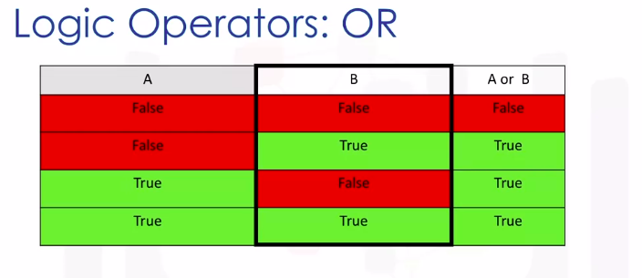
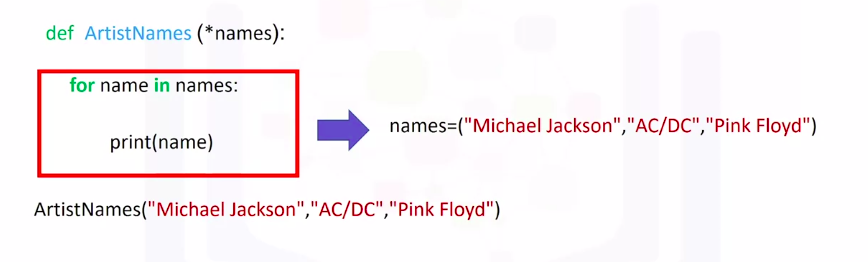
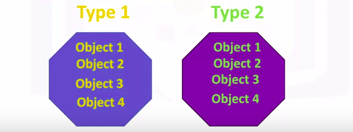
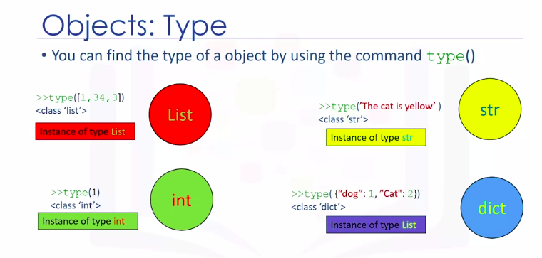
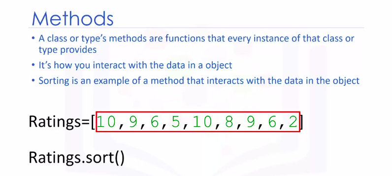
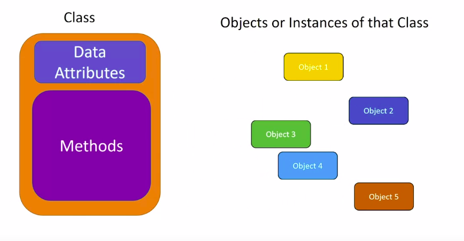
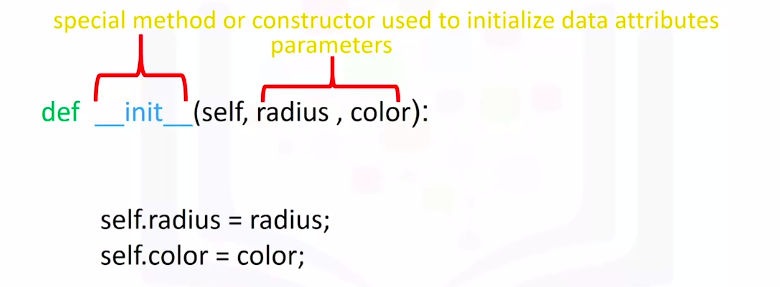
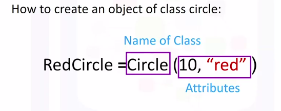
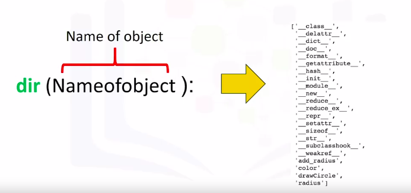

Python for Data Science and AI
===============================

by IBM

# Module 3

## Key Concepts
* Classify conditions and branching by identifying structured scenarios with outputs.
* Understand loops by using visual examples and comparing them to tuples and lists.
* Understand functions by building a function using inputs and outputs.
* Explain objects and classes by identifying data types and creating a class.

#
## Title: Python Programming Fundamentals

## Conditions and Branching

### Conditions and Branching

#### Comparision Operators

* Comparison operations compares some value or operand
	* Then based on some condition, they produce a Boolean
* Operators
	* **equality operator** `==`
		* We can use the **equality operator** denoted with **two equal signs** `==` to determine if two values are equal or not
		* We compare strings as well
		* If two values are equal, it returns **True**
		* If two values are not equal, it returns **False**
			```python
			>>> x = 6
			>>> y = 7
			>>> z = 6
			>>> x == y
				False
			>>> x == z
				True
			>>> 'test' == 'test'
				True
			>>> 'test' == 'test1'
				False
			```
	* **greater than operator** `>`
		* To check if the value of left operator/operand is __greater than__ the value of right operator/operand
		* If value of left operator/operand is __greater than__ value of right operator/operand, it returns **True**
		* If value of left operator/operand is not __greater than__ value of right operator/operand, it returns **False**
			```python
			>>> x = 6
			>>> y = 5
			>>> z = 6
			>>> x > y
				True
			>>> y > x
				False
			>>> z > x
				False
			```
	* **greater than equal to operator** `>=`
		* To check if the value of left operator/operand is __greater than or equal to__ the value of right operator/operand
		* If value of left operator/operand is __greater than or equal to__ value of right operator/operand, it returns **True**
		* If value of left operator/operand is not __greater than or equal to__ value of right operator/operand, it returns **False**
			```python
			>>> x = 6
			>>> y = 5
			>>> z = 6
			>>> x >= y
				True
			>>> y >= x
				False
			>>> z >= x
				True
			```
	* **less than operator** `<`
		* To check if the value of left operator/operand is __less than__ the value of right operator/operand
		* If value of left operator/operand is __less than__ value of right operator/operand, it returns **True**
		* If value of left operator/operand is not __less than__ value of right operator/operand, it returns **False**
			```python
			>>> x = 6
			>>> y = 5
			>>> z = 6
			>>> x < y
				False
			>>> y < x
				True
			>>> z < x
				False
			```
	* **less than equal to operator** `<=`
		* To check if the value of left operator/operand is __less than or equal to__ the value of right operator/operand
		* If value of left operator/operand is __less than or equal to__ value of right operator/operand, it returns **True**
		* If value of left operator/operand is not __less than or equal to__ value of right operator/operand, it returns **False**
			```python
			>>> x = 6
			>>> y = 5
			>>> z = 6
			>>> x <= y
				False
			>>> y <= x
				True
			>>> z <= x
				True
			```
	* **inequality operator** `!=`
		* We can use the **inequality operator** denoted with **exclamation sign followed by equal to sign** `!=` to determine if two values are not equal
		* We compare strings as well
		* If two values are not equal, it returns **True**
		* If two values are equal, it returns **False**
			```python
			>>> x = 6
			>>> y = 7
			>>> z = 6
			>>> x != y
				True
			>>> x != z
				False
			>>> 'test' != 'test'
				False
			>>> 'test' != 'test1'
				True
			```

#### Branching

* **Branching** allows us to run different statements for a different input
* **Conditional Operator**
	* **if** statement
		* It's helpful to think of an if statement as a locked room
			1. If this statement is **True**, your program can **run** some **predefined task**
			1. If the statement is **False**, your program will **skip** the **task**
				```python
				>>> age = 19
				>>> if age > 18:
				>>>		print('You can enter') # Within an indent, we have the expression that is run if the condition is True
				>>> print('Move on') # The statements after the if statement will run regardless if the condition is true or false
					'You can enter'
					'Move on'
				>>> age = 17
				>>> if age > 18:
				>>>		print('You can enter')
				>>> print('Move on')
					'Move on'
				```
				* The brackets are not necessary
				* We have a colon
				* Within an indent, we have the expression that is run if the condition is True
				* The statements after the if statement will run regardless if the condition is true or false
	* **if-else** statement
		* The **else** statement will run its block of code if condition of `if` statement is False
		* If this statement is **True**, your program can **run** some **predefined task**
		* If the statement is **False**, your program will go to **else** block and execute **tasks** inside else
			```python
			>>> age = 19
			>>> if age > 18:
			>>>		print('You can enter') # Within an indent, we have the expression that is run if the condition is True
			>>> else:
			>>> 	print('You cannot enter') # This is executed when IF condition is false
			>>> print('Move on') # The statements after the if statement will run regardless if the condition is true or false
				'You can enter'
				'Move on'
			>>> age = 17
			>>> if age > 18:
			>>>		print('You can enter')
			>>> else:
			>>> 	print('You cannot enter')
			>>> print('Move on')
				'You cannot enter'
				'Move on'
			```
	* **if-elif-else** statement
		* **elif** is short for else if
		* The **elif** statement will run its block of code if all preceding conditions are False
		* It allows us to check additional conditions if the preceding condition is False
			```python
			>>> age = 19
			>>> if age > 18:
			>>>		print('You can enter') # Within an indent, we have the expression that is run if the condition is True
			>>> elif age == 18:
			>>> 	print('Go to food court') # The elif statement will run its block of code if all previous conditions are False
			>>> else:
			>>> 	print('You cannot enter') # This is executed when IF condition is false
			>>> print('Move on') # The statements after the if statement will run regardless if the condition is true or false
				'You can enter'
				'Move on'
			>>> age = 17
			>>> if age > 18:
			>>>		print('You can enter')
			>>> elif age == 18:
			>>> 	print('Go to food court')
			>>> else:
			>>> 	print('You cannot enter')
			>>> print('Move on')
				'You cannot enter'
				'Move on'
			>>> age = 18
			>>> if age > 18:
			>>>		print('You can enter')
			>>> elif age == 18:
			>>> 	print('Go to food court')
			>>> else:
			>>> 	print('You cannot enter')
			>>> print('Move on')
				'Go to food court'
				'Move on'
			```
* **Logic Operators**
	* **not**
		* If the input is **True**, the result is a **False** and vice versa
	* **or**
		* The **OR** operator takes in the two values and produces a new Boolean value
		* the **OR** operator only produces a false if all the Boolean values are false
		* Check image below to check how it works
			<p align="center">
			  <a href="javascript:void(0)" rel="noopener">
				 </a>
			</p>
			* The first column represents the possible values of A
			* The second column represents the possible values of B
			* The final column represents the result of applying the OR operation
				```python
				>>> album_year = 1990
				>>> if (album_year < 1980) or (album_year > 1989)
				>>> 	print("The album was made in the 70's or 90's")
				>>> else:
				>>>		print("The album was made in 1980's")
					The album was made in the 70's or 90's
				```
	* **and**
		* The **AND** operator takes in the two values and produces a new Boolean value
		* the **AND** operator only produces a true if all the Boolean values are true
		* Check image below to check how it works
			<p align="center">
			  <a href="javascript:void(0)" rel="noopener">
				 </a>
			</p>
			* The first column represents the possible values of A
			* The second column represents the possible values of B
			* The final column represents the result of applying the AND operation
				```python
				>>> album_year = 1989
				>>> if (album_year > 1980) and (album_year < 1990)
				>>> 	print("The album was made in the 70's or 90's")
				>>> else:
				>>>		print("The album was made in 1980's")
					The album was made in the 70's or 90's
				```
* **Branching** allows us to run different statements for different inputs

## Loops

### Loops

* **range**
	* The range function outputs and ordered sequence as a list
	* If the input is a positive integer, the output is a sequence
	* The sequence contains the same number of elements as the input but starts at zero
		```python
		>>> range(4)
		```
		<p align="center">
		  <a href="javascript:void(0)" rel="noopener">
			 </a>
		</p>
	* If the range function has two inputs where the first input is larger than the second input, the output is a sequence that starts at the first input
		* Then the sequence iterates up to but not including the second number
		```python
		>>> range(10, 15)
		```
* **for** loops
	* Loops perform a task over and over
		```python
		>>> squares = ['red', 'yellow', 'green', 'purple', 'blue']
		>>> for i in range(0, 5): # the value of 'i' is incremented by one each time
		>>> 	squares[i] = 'white' # In this segment we change the 'i' element of the list to the string white
		```
	* We can iterate directly on a list or tuple, we do not even need to use indices
		```python
		>>> squares = ['red', 'yellow', 'green', 'purple', 'blue']
		>>> for square in squares:
		>>> 	print(square)
		```
* **enumerate**
	* It is a useful function for iterating data
	* It can be used to obtain the **index** and the element in the list
		```python
		>>> squares = ['red', 'yellow', 'green', 'purple', 'blue']
		>>> # This is the syntax to iterate through a list and provide the index of each element
		>>> for idx, square in enumerate(squares):
		>>> 	print(idx, square)
		```
		* In this case squares the variable **idx** is the index and the variable **square** is the corresponding element in the list
	* The argument of the function enumerate is the **list**
* **while** loops
	* While loops are similar to for loops but instead of executing a statement a set number of times a **while loop will only run if a condition is met**
		```python
		>>> squares = ['orange', 'orange', 'purple', 'orange', 'blue']
		>>> new_squares = []
		>>> i = 0
		>>> while (squares[i]=='orange'):
		>>> 	new_squares.append(squares[i])
		>>> 	i += 1
		>>> print(new_squares)
			['orange', 'orange']
		```

## Functions

### Functions

* A function is a reusable block of code which performs operations specified in the function
	* They let you break down tasks and allow you to reuse your code in different programs
* There are two types of functions
	1. Pre-defined functions
	1. User defined functions
* Functions take some input, then produce some output or change
* The function, it's just a piece of code you can reuse
* **Methods** are similar to functions
	* They produce a new output
* Python has many built-in functions
	* **len**
		* It  takes in an input of type sequence such as a string, or list, or type collection such as a dictionary or set and returns the length of that sequence or collection
			```python
			>>> album_ratings = [10.0, 8.5, 9.5, 7.0, 7.0, 9.5, 9.0, 9.5]
			>>> L = len(album_ratings)
			>>> print(L)
				8
			```
	* **sum**
		* It takes in an iterable like a tuple or list and returns the total of all the elements
			```python
			>>> album_ratings = [10.0, 8.5, 9.5, 7.0, 7.0, 9.5, 9.0, 9.5]
			>>> S = sum(album_ratings)
			>>> print(S)
				70
			```
	* Sorting
		* There are 2 ways to sort a list
			1. **sorted**
				* The function sorted returns a new sorted list or tuple
					```python
					>>> album_ratings = [10.0, 8.5, 9.5, 7.0, 7.0, 9.5, 9.0, 9.5]
					>>> sorted_album_ratings = sorted(album_ratings)
					>>> sorted_album_ratings
						[7.0, 7.0, 8.5, 9.0, 9.5, 9.5, 9.5, 10.0]
					```
				* They produce a new output. In this instance, a sorted list
			1. **sort**
				* If we use the method sort, the list will change and no new list will be created
					```python
					>>> album_ratings = [10.0, 8.5, 9.5, 7.0, 7.0, 9.5, 9.0, 9.5]
					>>> album_ratings.sort()
					>>> album_ratings
						[7.0, 7.0, 8.5, 9.0, 9.5, 9.5, 9.5, 10.0]
					```
					* When we apply the method sort to the list, the list album_rating changes
					* Unlike the previous case, we see that list album_rating has changed. In this case, no new list is created
* User Defined Functions
	* An example of a function in Python that returns its input value plus one
		```python
		>>> def add1(a):
		>>> 	b = a+1
		>>> 	return b
		```
	* To define a function
		* We start with the keyword **def**
		* The name of the function should be descriptive of what it does
		* We have the function formal parameter in parentheses `(param1, param2, ...)`, followed by a colon `:`
		* We have a code block with an indent
		* After we define the function, we can call it
		* It's customary to document the function on the first few lines
			* This tells anyone who uses the function what it does
			* This documentation is surrounded in triple quotes
				```python
				>>> def add1(a):
				>>>		"""
				>>> 	adds 1 to 'a'
				>>> 	"""
				>>> 	b = a+1
				>>> 	return b
				```
			* You can use the help command on the function to display the documentation
				```python
				>>> help(<function name>)
				```
				* This will print out the function name and the documentation
		* A function can have multiple parameters
			```python
			>>> def mult(a, b):
			>>> 	c = a * b
			>>>		return c
			>>> mult(2, 3)
				6
			>>> mult(10, 3.14)
				31.4
			>>> mult(2, 'test ') # This is because the multiplication symbol can also mean repeat a sequence
				'test test '
			```
		* In many cases, a function does not have a return statement. In these cases, Python will return the special **none object**
		* Python **doesn't allow** a function to have an **empty body**
			* So we can use the keyword pass, which doesn't do anything, but satisfies the requirement of a **none empty body**
				```python
				>>> def NoWords():
				>>> 	pass
				>>> print(NoWords())
					None
				```
		* if the return statement is not called, Python will automatically return a **none**
		* We can use loops in functions
			```python
			>>> def printStuff(Stuff):
			>>> 	for i, s in enumerate(Stuff):
			>>>			print("Album ", i, " Rating is ", s)
			>>>
			>>> album_ratings = [10.0, 8.5, 9.5]
			>>> printStuff(album_ratings)
			```
* **Variadic parameters** allow us to input a variable number of elements
	```python
	>>> def ArtistNames(*names):
	>>> 	for name in names:
	>>> 		print(name)
	```
	<p align="center">
	  <a href="javascript:void(0)" rel="noopener">
		 </a>
	</p>
* **Scope**
	* The scope of a variable is the part of the program where that variable is accessible
	* Variables are defined outside of any function are said to be within the **global scope**, meaning they can be accessed anywhere after they are defined
	* **Local variables** only exist within the scope of a function
	* If a variable is not defined within a function, Python will check the global scope
	* If we define the variable with the keyword global, the variable will be a global variable
		```python
		>>> def pinkFloyd():
		>>> 	global ClaimedSales
		>>> 	ClaimedSales = '45 million'
		>>> 	return ClaimedSales
		>>> pinkFloyd()
		>>> print(ClaimedSales)
			'45 million'
		```

## Objects and Classes

### Objects and Classes

* Python has many different kinds of data types: integers, floats, strings, lists, dictionaries, booleans
	* In Python, each is an **object**
* Every **object** has the following
	1. a type
	1. an internal data representation (a blueprint)
	1. a set of procedures for interacting with the object (methods)
		* a set of functions called **methods** to interact with the data
* An **object** is an **instance** of a particular **type**
	* For example, we have two types, type one and type two
		1. We can have several objects of type one as shown in yellow. Each object is an instance of type one
		1. We also have several objects of type two shown in green. Each object is an instance of type two
			<p align="center">
			  <a href="javascript:void(0)" rel="noopener">
				 </a>
			</p>
* **type**
	* To find out the type of an object
		<p align="center">
		  <a href="javascript:void(0)" rel="noopener">
			 </a>
		</p>
* **Methods**
	* A class or type's methods are functions that every instance of that class or type provides
	* It's how you interact with the object
	* For example, 
		* On **lists**
			* **Sorting** is an example of a method that interacts with the data in the object
				* Consider the list ratings, the data is a series of numbers contained within the list
					* The method sort will change the data within the object
					* We call the method by adding a **period '.'** at the end of the object's name, and the method's name we would like to call with **parentheses**
						<p align="center">
						  <a href="javascript:void(0)" rel="noopener">
							 </a>
						</p>
						<p align="center">
						  <a href="javascript:void(0)" rel="noopener">
							 </a>
						</p>
			* **reverse**
				* This method will reverse the order of the sequence within the object
					<p align="center">
					  <a href="javascript:void(0)" rel="noopener">
						 </a>
					</p>
* Defining **Class** or **Type**
	* **Classes** are outlines we have to set the **attributes** to **create objects**
	* The class has data attributes
	* The class has methods
	* We then create instances or instances of that class or objects
	* The class data attributes define the class
		<p align="center">
		  <a href="javascript:void(0)" rel="noopener">
			 </a>
		</p>
	* To create the class
		1. you will need to include the class definition
			* This tells Python you're creating your own class
		1. the name of the class
		1. In parentheses, you will always place the term object, this is the parent of the class
			<p align="center">
			  <a href="javascript:void(0)" rel="noopener">
				 </a>
			</p>
		1. We define our class
		1. We then initialize each instance of the class with data attributes like radius, and color using the class constructor
		1. The function **init** is a constructor
			1. It's a special function that tells Python you are making a new class
			1. The self parameter refers to the newly created instance of the class
				<p align="center">
				  <a href="javascript:void(0)" rel="noopener">
					 </a>
				</p>
				<p align="center">
				  <a href="javascript:void(0)" rel="noopener">
					 </a>
				</p>
	* In order to create an object of class circle
		1. We introduce a variable
			1. This will be the name of the object
		1. We create the object by using the object constructor
			1. The object constructor consists of the 'name of the class' as well as the 'parameters' (parameters: These are the data attributes)
				<p align="center">
				  <a href="javascript:void(0)" rel="noopener">
					 </a>
				</p>
		1. The arguments passed to the constructor are used to initialize the data attributes of the newly created class instance
		1. It is helpful to think of **self** as a box that contains all the data attributes of the object
		1. Typing the object's name followed by a dot and the data attribute name gives us the data attribute value
			<p align="center">
			  <a href="javascript:void(0)" rel="noopener">
				 </a>
			</p>
	* In Python, we can also set or change the data attribute directly
		* Typing the object's name followed by a dot and the data attribute name, and set it equal to the corresponding value
			```python
			>>> C1 = Circle(4, 'red')
			>>> C1.color = 'blue'
			>>> C1.color
				'blue'
			```
	* We can add **default** values to the **parameters** of a class as constructor
	* The **dir** function is useful for obtaining the list of data attributes and methods associated with a class
		* The object you're interested in is passed as an argument
		* The return value is a list of the objects data attributes
		* The attribute surrounded by underscores are for internal use, and you shouldn't have to worry about them
		* These are the objects, methods, and data attributes
			<p align="center">
			  <a href="javascript:void(0)" rel="noopener">
				 </a>
			</p>

