Python for Data Science and AI
===============================

by IBM

# Module 4

## Key Concepts
* Demonstrate an open function to create and identify a file object.
* Understand how to use pandas for library and data analysis by using commands.
* Demonstrate how to create a text file by using the open function.
* Demonstrate how to use NumPy to create multi-dimensional arrays.

#
## Title: Working with Data in Python

## Reading Files with Open

### Reading Files with Open

* **open**
	* It is used to create a file object, and obtain the data from a "txt" file
		```python
		>>> file1 = open('/path/to/file/sample.txt', 'r')
		>>> 
		```
		* params for open meethod
			1. 1st is path of file to open
			1. 2nd is mode, it has different modes
				1. 'r' - reading
				1. 'w' - writing
				1. 'a' - appending
	* The data attribute `name` is used to get the name of the file
		* The result is a string that contains the name of the file
			```python
			>>> file1 = open('/path/to/file/sample.txt', 'r')
			>>> file1.name
				'/path/to/file/sample.txt'
			```
	* The data attribute `mode` is used to check the mode of an object is in
		```python
			>>> file1 = open('/path/to/file/sample.txt', 'r')
			>>> file1.mode
				'r'
			```
	* You should always close the file object using the method close
		* This may get tedious sometimes, so we can also use the **with** statement
		```python
		>>> file1 = open('/path/to/file/sample.txt', 'r')
		>>> file1.name
		>>> file1.close()
		```
	* Using a **with** statement to open a file is **better practice** because it automatically closes the file
		* The code will run everything in the indent block, then closes the file
			```python
			>>> with open('example1.txt', 'r') as file1:
			>>> 	file_stuff = file1.read()
			>>> 	print(file_stuff)
			>>> print(file1.closed)
			>>> print(file_stuff)
			```
	* We can output every line as an element in a list using the method **readlines**
		* We can specify the number of characters we would like to read from the string as an argument to the method **readlines**
	* We can use the method **readline** to read the first line of the file
		* Everytime it is called it will read the next line

## Writing Files with Open

### Writing Files with Open

* We can also write to files using the open function
* We will use Python's open function to get a file object to create a text file.
	* We can apply method write to write data to that file
		```python
		>>> with open('/resources/data/Example2.txt', 'w') as writefile:
    	>>> 	writefile.write("This is line A")
    	>>>
    	>>> with open('/resources/data/Example2.txt', 'a') as testwritefile:
    	>>> 	testwritefile.write("This is line C\n")
		```
* We use the method **write**, to write data into the file
	* The **argument** is the text we would like input into the file
* If we use the **write** method successively, each time it is called, it will write to the file

## Pandas

### Pandas

> A **CSV** is a typical file type used to store data

* **Dependencies** or **libraries** are pre-written code to help solve problems
* **Pandas**, a popular library for data analysis
* We can import the library or a dependency like Pandas using the following command
	```python
	>>> import pandas
	```
* Buil-in Function
	1. **read_csv()**
		* This is used to load a CSV file
			```python
			# We can use the as statement to shorten the name of the library, like 'pd'
			>>> import pandas as pd
			>>> csv_path = 'file1.csv'
			>>> df = pd.read_csv(csv_path)
			>>> df.head() # By Default, it shows top 5 rows of a dataframe
			```
			<p align="center">
			  <a href="javascript:void(0)" rel="noopener">
				 </a>
			</p>
	1. **read_excel()**
		* This is used to load a EXCEL file
			```python
			# We can use the as statement to shorten the name of the library, like 'pd'
			>>> import pandas as pd
			>>> xlsx_path = 'file2.xlsx'
			>>> df = pd.read_excel(xlsx_path)
			>>> df.head() # By Default, it shows top 5 rows of a dataframe
			```
			<p align="center">
			  <a href="javascript:void(0)" rel="noopener">
				 </a>
			</p>
* A **DataFrame** is comprised of rows and columns
	* We can create a data frame out of a dictionary
		1. The keys correspond to the column labels
		1. The values or lists corresponding to the rows
	* We then **cast** the **dictionary** to a data frame using the function **DataFrame**
		<p align="center">
		  <a href="javascript:void(0)" rel="noopener">
			 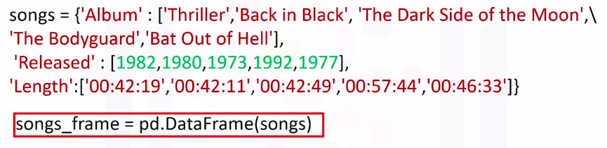</a>
		</p>
		<p align="center">
		  <a href="javascript:void(0)" rel="noopener">
			 </a>
		</p>
* We can create a new data frame 
	1. consisting of one column
		* We just put the data frame name, in this case, df, and the name of the column header enclosed in double brackets
			* The result is a new data frame comprised of the original column
				<p align="center">
				  <a href="javascript:void(0)" rel="noopener">
					 </a>
				</p>
	1. consisting of multiple columns
		* We just put the data frame name, in this case, df, and the name of the multiple column headers enclosed in double brackets
			* The result is a new data frame comprised of the specified columns
				<p align="center">
				  <a href="javascript:void(0)" rel="noopener">
					 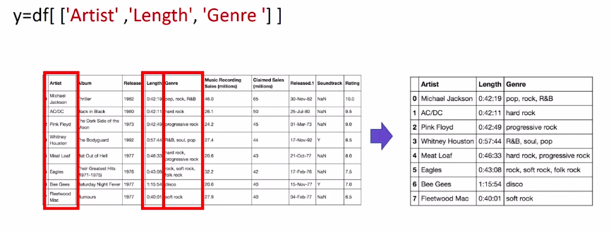</a>
				</p>

#### Pandas: Working with and Saving Data

* **unique**
	* This method determines the unique elements in a column of a data frame
		```python
		>>> import pandas as pd
		>>> csv_path = 'file1.csv'
		>>> df = pd.read_csv(csv_path)
		>>> df['Released'].unique()
		```
		<p align="center">
		  <a href="javascript:void(0)" rel="noopener">
			 </a>
		</p>
* Filtering out df in pandas
	<p align="center">
	  <a href="javascript:void(0)" rel="noopener">
		 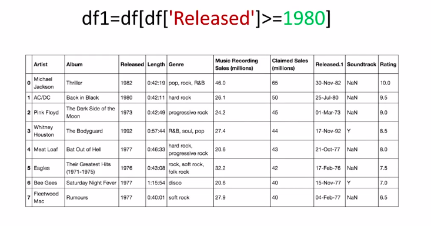</a>
	</p>
* **to_csv()**
	* This method is used to save dataframe into a file
	* The argument is the name of the csv file
		* Make sure you include a `.csv` extension
			```python
			>>> import pandas as pd
			>>> csv_path = 'file1.csv'
			>>> df = pd.read_csv(csv_path)
			>>> df1 = df[df['Released'] >= 1970]
			>>> df1.to_csv('new_df.csv')
			```

## One Dimensional Numpy

### One Dimensional Numpy

> We will checkout the basics and array creation, indexing and slicing, basic operations, universal functions

* **Numpy** is a library for scientific computing
* There are many other advantages like **speed** and **memory**
* Numpy is also the basis for pandas
* A Python list is a container that allows you to store and access data
	* Each element is associated with an index
	* We can access each element using a square bracket
* A **numpy array** or **ND array** is similar to a **list**
	* It's usually fixed in size and each element is of the same type, like integer
	* We can cast a list to a numpy array by first importing numpy
		```python
		>>> import numpy as np
		>>> a = np.array([1,2,3,4]) # Casting a list o numpy array
			array([1,2,3,4])
		>>> type(a)
			numpy.ndarray
		>>> a.dtype
			dtype('int64')
		```
* Basic Attributes
	1. **size**
		* The attribute size is the number of elements in the array
			```python
			>>> import numpy as np
			>>> a = np.array([1,2,3,4]) # Casting a list o numpy array
				array([1,2,3,4])
			>>> a.size
				5
			```
	1. **ndim**
		* The attribute ndim represents the number of array dimensions or the rank of the array
			```python
			>>> import numpy as np
			>>> a = np.array([1,2,3,4]) # Casting a list o numpy array
				array([1,2,3,4])
			>>> a.ndim
				1
			```
	1. **shape**
		* The attribute shape is a tuple of integers indicating the size of the array in each dimension
			```python
			>>> import numpy as np
			>>> a = np.array([1,2,3,4]) # Casting a list o numpy array
				array([1,2,3,4])
			>>> a.shape
				(5,)
			```
* We can create a numpy array with real numbers
	<p align="center">
	  <a href="javascript:void(0)" rel="noopener">
		 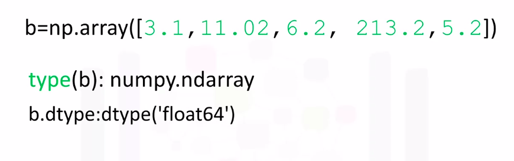</a>
	</p>

#### Indexing and Slicing Methods

* Like lists and tuples we can slice a NumPy array
	<p align="center">
	  <a href="javascript:void(0)" rel="noopener">
		 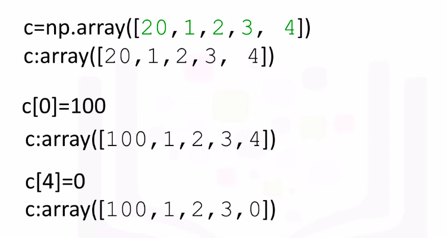</a>
	</p>
* Like lists, we do not count the element corresponding to the last index
* We can assign the corresponding indices to new values as mentioned in image below
	<p align="center">
	  <a href="javascript:void(0)" rel="noopener">
		 </a>
	</p>

#### Basic Operations

* Numpy makes it easier to do many operations that are commonly performed in data science. The same operations are usually computationally faster and require less memory in numpy compared to regular Python
* Vector **Addition** and **Subtraction**
	* Vector addition is a widely used operation in data science
	* Example
		* In vector addition, we create a new vector in this case z. The first component of z is the addition of the first component of vectors u and v. Similarly, the second component is the sum of the second components of u and v. This new vector z is now a linear combination of the vector u and v
			<p align="center">
			  <a href="javascript:void(0)" rel="noopener">
				 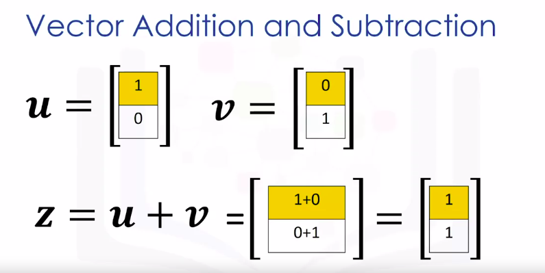</a>
			</p>
		* Check image below to undestand this text:
			* Representing vector addition with line segment or arrows is helpful
				* The first vector is represented in red. The vector will point in the direction of the two components. The first component of the vector is one. As a result the arrow is offset one unit from the origin in the horizontal direction. The second component is zero, we represent this component in the vertical direction. As this component is zero, the vector does not point in the horizontal direction
			* We represent the second vector in blue. The first component is zero, therefore the arrow does not point to the horizontal direction. The second component is one. As a result the vector points in the vertical direction one unit
			* When we add the vector u and v, we get the new vector z. We add the first component, this corresponds to the horizontal direction. We also add the second component
				* It's helpful to use the tip to tail method when adding vectors, placing the tail of the vector v on the tip of vector u. The new vector z is constructed by connecting the base of the first vector u with the tail of the second v
					<p align="center">
					  <a href="javascript:void(0)" rel="noopener">
						 </a>
					</p>
	* Vector Addition code in numpy vs normal python
		<p align="center">
		  <a href="javascript:void(0)" rel="noopener">
			 </a>
		</p>
	* Vector Subtraction code in numpy vs normal python
		<p align="center">
		  <a href="javascript:void(0)" rel="noopener">
			 </a>
		</p>
* Vector **Multiplication** with a Scalar
	* Vector Multiplication with a Scalar in numpy vs normal python
		<p align="center">
		  <a href="javascript:void(0)" rel="noopener">
			 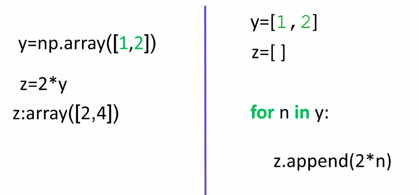</a>
		</p>
* **Hadamard Product** or Product of two numpy arrays
	* It is another widely used operation in data science
	* What is Hadamard Product
		<p align="center">
		  <a href="javascript:void(0)" rel="noopener">
			 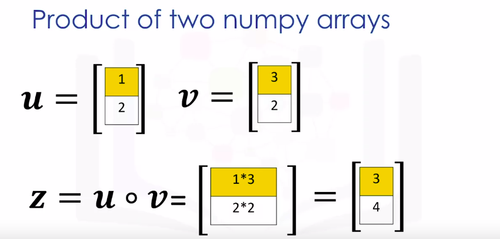</a>
		</p>
	* Hadamard Product in numpy vs normal python
		<p align="center">
		  <a href="javascript:void(0)" rel="noopener">
			 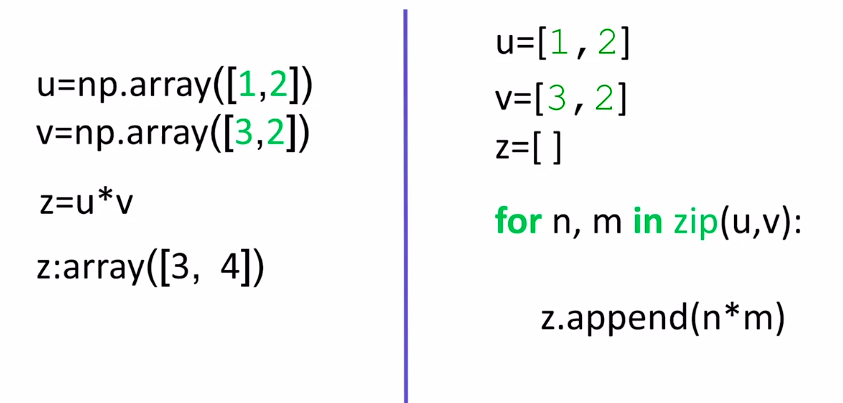</a>
		</p>
* **DOT Product**
	* What is dot product
		<p align="center">
		  <a href="javascript:void(0)" rel="noopener">
			 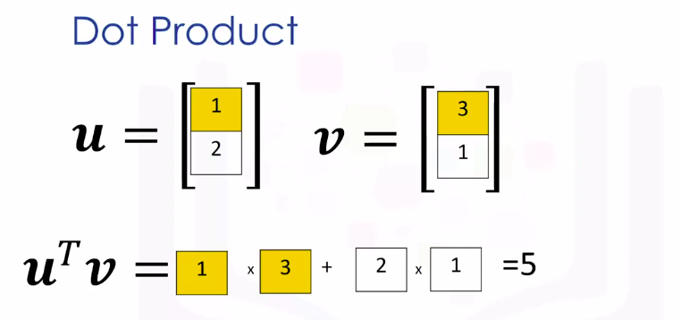</a>
		</p>
	* Code in python numpy
		<p align="center">
		  <a href="javascript:void(0)" rel="noopener">
			 </a>
		</p>
* **Broadcasting**
	* Broadcasting : If we add a scalar value to the array, numpy will add that value to each element
* **Universal Function**
	* A **Universal Function** is a function that operates on ND arrays
	* Example:
		1. **mean()**
		1. **max()**
		1. **np.pi** - to access the value of pi
		1. **sin(np.array)** - This applies the sin function to each element in the array, this corresponds to applying the sine function to each component of the vector
		1. **np.linspace** - Line space returns evenly spaced numbers over specified interval
			1. We specify the starting point of the sequence, the ending point of the sequence. The parameter num indicates the number of samples to generate
				```python
				>>> np.linspace(-2,2,num=5)
				```
				* We can use the function line space to generate 100 evenly spaced samples from the interval zero to two pie
* Plotting Mathematical Functions
	* Sample
		<p align="center">
		  <a href="javascript:void(0)" rel="noopener">
			 </a>
		</p>

## Two Dimensional Numpy

### Two Dimensional Numpy

* We can create numpy arrays with more than one dimension
* Consider the list a, the list contains three nested lists each of equal size
	* We can cast the list to a numpy array as follows. It is helpful to visualize the numpy array as a rectangular array each nested lists corresponds to a different row of the matrix
		<p align="center">
		  <a href="javascript:void(0)" rel="noopener">
			 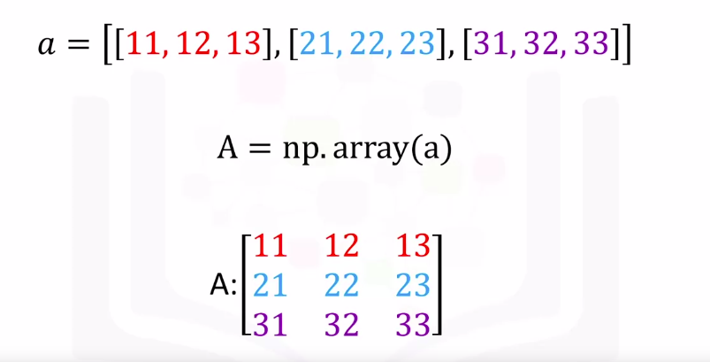</a>
		</p>
* **ndim**
	* use the attribute **ndim** to obtain the number of axes or dimensions referred to as the __rank__
	* The term rank does not refer to the number of linearly independent columns like a matrix
	* It's useful to think of ndim as the number of nested lists
		* The first list represents the **first dimension**
		* This list contains another set of lists. This represents the **second dimension** or **axis**
	* The number of lists the list contains does not have to do with the dimension but the shape of the list
		<p align="center">
		  <a href="javascript:void(0)" rel="noopener">
			 </a>
		</p>
* **shape**
	* the attribute shape returns a tuple
	* It's helpful to use the rectangular representation as well
		* The first element in the tuple corresponds to the number of nested lists contained in the original list or the number of rows in the rectangular representation
		* The second element corresponds to the size of each of the nested list or the number of columns in the rectangular array zero
			<p align="center">
			  <a href="javascript:void(0)" rel="noopener">
				 </a>
			</p>
* **size**
	* the attribute size to get the size of the array
	* We see there are three rows and three columns. Multiplying the number of columns and rows together, we get the total number of elements
		<p align="center">
		  <a href="javascript:void(0)" rel="noopener">
			 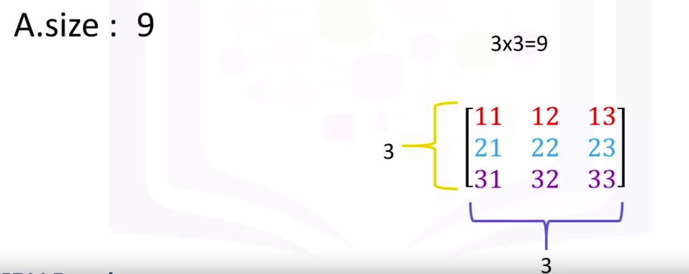</a>
		</p>
* **Rectangular brackets** can be used to access the different elements of the array
	* The following image demonstrates the relationship between the indexing conventions for the lists like representation
	* Using the rectangular representation
		* the first index corresponds to the **row** index
		* The second index corresponds to the **column** index
			<p align="center">
			  <a href="javascript:void(0)" rel="noopener">
				 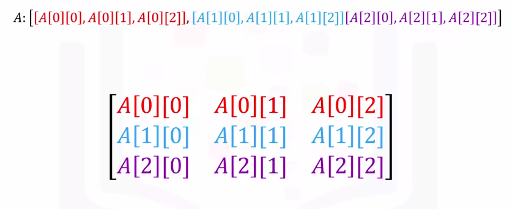</a>
			</p>
	* We could also use a single bracket to access the elements as follows
		<p align="center">
		  <a href="javascript:void(0)" rel="noopener">
			 </a>
		</p>
	* Example
		<p align="center">
		  <a href="javascript:void(0)" rel="noopener">
			 </a>
		</p>
* **Slicing** in 2D Numpy array
	* Example 1
		<p align="center">
		  <a href="javascript:void(0)" rel="noopener">
			 </a>
		</p>
	* Example 2
		<p align="center">
		  <a href="javascript:void(0)" rel="noopener">
			 </a>
		</p>
* **Matrix Addition**
	* We can add the matrices. This corresponds to adding the elements in the same position
	* Example
		<p align="center">
		  <a href="javascript:void(0)" rel="noopener">
			 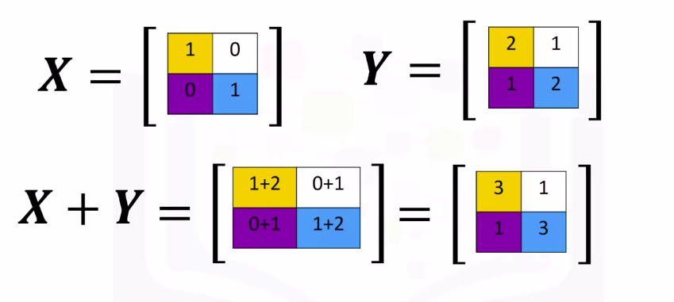</a>
		</p>
		* Each element in this new matrix is the sum of the corresponding elements in X and Y
	* To add two arrays in numpy, we define the array in this case X. Then we define the second array Y, we add the arrays. The result is identical to matrix addition
		<p align="center">
		  <a href="javascript:void(0)" rel="noopener">
			 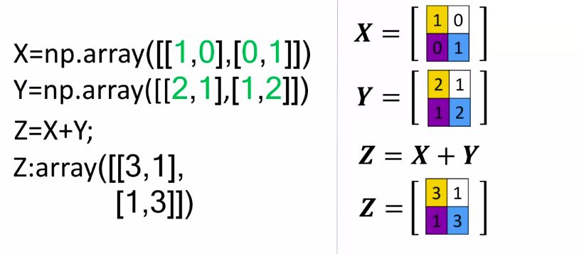</a>
		</p>
* **Matrix Mutliplication with a Scalar**
	* Multiplying a numpy array by a scalar is identical to multiplying a matrix by a scalar
		<p align="center">
		  <a href="javascript:void(0)" rel="noopener">
			 </a>
		</p>
		* The result is a new matrix of the same size where each element is multiplied by two
	* Python code using numpy
		<p align="center">
		  <a href="javascript:void(0)" rel="noopener">
			 </a>
		</p>
* **Hadamard Product**
	* Multiplication of two arrays corresponds to an element-wise product, or Hadamard product
	* Hadamard product corresponds to multiplying each of the elements in the same position
		* The result is a new matrix that is the same size as matrix Y or X
		* Each element in this new matrix is the product of the corresponding elements in X and Y
			<p align="center">
			  <a href="javascript:void(0)" rel="noopener">
				 </a>
			</p>
	* Python code using numpy
		<p align="center">
		  <a href="javascript:void(0)" rel="noopener">
			 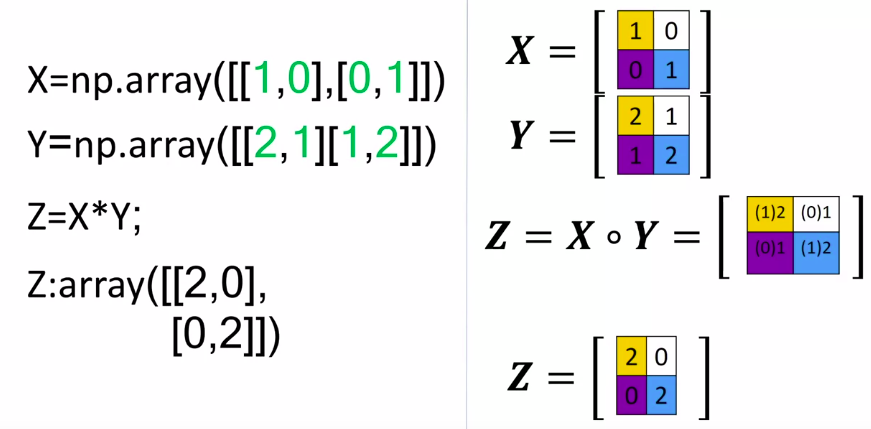</a>
		</p>
* **Matrix Multiplication** or **DOT Product**
	* Consider the matrix A where each row is a different color
	* Also, consider the matrix B where each column is a different color
	* In linear algebra, before we multiply matrix A by matrix B, we must make sure that the **number of columns** in *matrix A* is **equal** to the **number of rows** in *matrix B*
	* From matrix multiplication, to obtain the i<sup>th</sup> row and j<sup>th</sup> column of the new matrix, we take the **dot product** of the i<sup>th</sup> row of a with the j<sup>th</sup> columns of B
		<p align="center">
		  <a href="javascript:void(0)" rel="noopener">
			 </a>
		</p>
	* Python code using numpy
		<p align="center">
		  <a href="javascript:void(0)" rel="noopener">
			 </a>
		</p>

## Sample APIs

### Sample APIs

* API - Application Program Interfaces
* An API lets two pieces of software talk to each other
* For example
	* you have your program, you have some data, you have other software components, you use the API to communicate with the API via inputs and outputs
* Just like a function, you don't have to know how the API works but just as inputs and outputs
* When you create a dictionary and then create a pandas object with a DataFrame constructor, in API lingo this is an **instance**
* **REST APIs**
	* They allow you to communicate through the Internet allowing you to take advantage of resources like storage, access more data, artificial intelligent algorithms and much more
	* The **RE** stands for **RE**presentational. The **S** stands for **S**tate. The T stands for **T**ransfer
	* In REST APIs, your program is called the **client**
	* The API communicates with a web service you call through the Internet
	* There is a set of rules regarding communication, input or request, and output or response
		* Some common terms
			* You or your code can be thought of as a client
			* The web service is referred to as a resource
			* The client finds the service via an endpoint
			* The client sends requests to the resource and the response to the client
			* HTTP methods are a way of transmitting data over the internet
			* We tell the REST APIs what to do by sending a request
			* The request is usually communicated via an HTTP message
				* The HTTP message usually contains json file
			* This contains instructions for what operation we would like the service to perform
			* This operation is transmitted to the web service via the Internet
			* The service performs the operation
			* In the similar manner, the web service returns a response via an HTTP message, where the information is usually return the json file
			* This information is transmitted back to the client
* API keys and endpoints
	* An **API key** as a way to access the API
		* It's a unique set of characters that the API uses to identify you and authorize you. Usually, your first call to the API includes the API key
			* This will allow you access to the API
		* In many APIs, you may get charged for each call
			* So like your password, you should keep your API key a secret
	* An **endpoint** is simply the location of the service
		* It's used to find the API on the Internet just like a web address